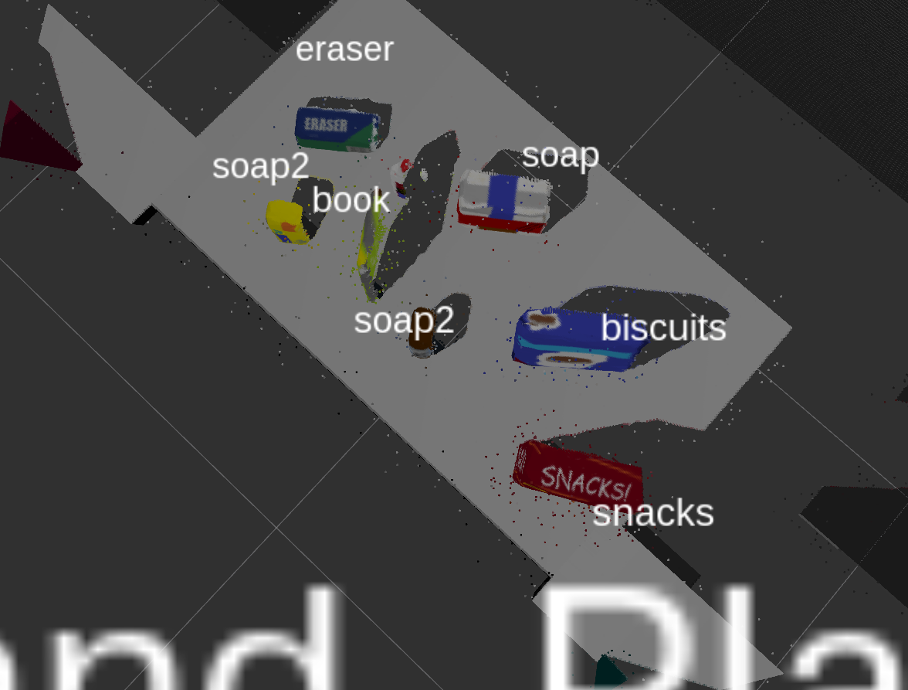
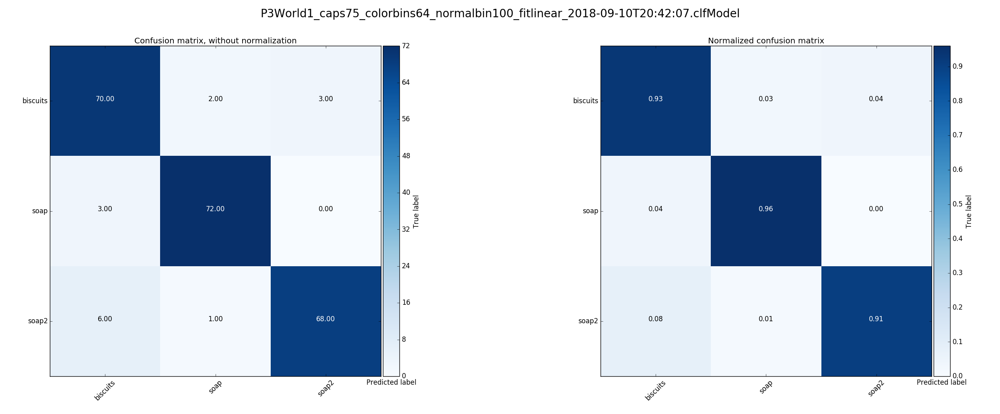
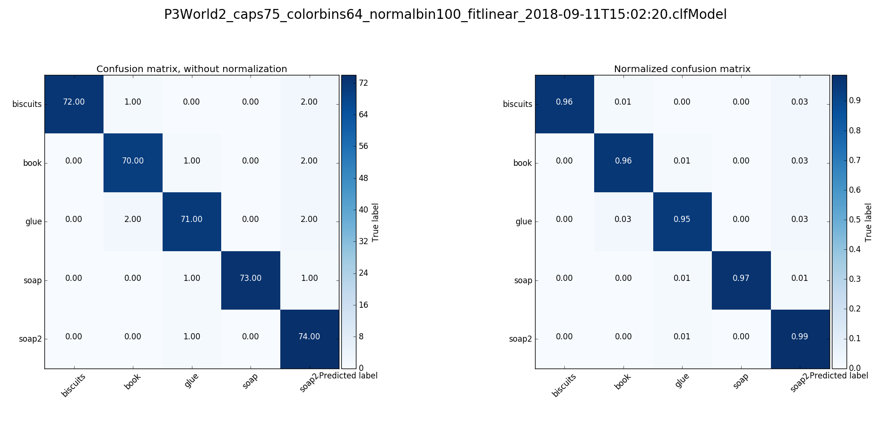
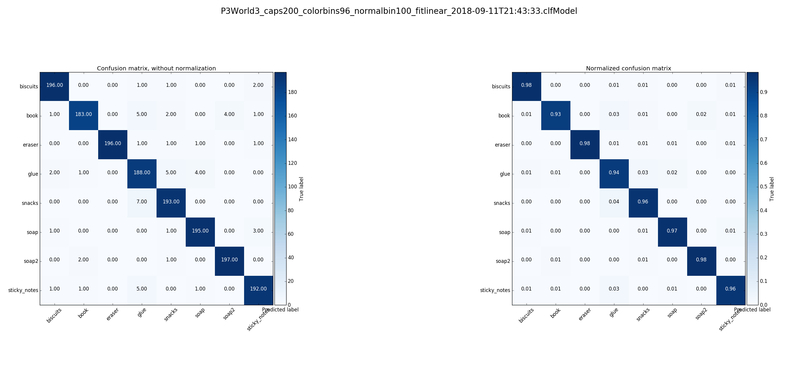

# roboND Proj3: 3D Perception Pick & Place
### Submission writeup: ChrisL 2018-10-13

---


<br/>

## **Overview**
Yet another fun but challenging assignment!
The goals / steps of this project are the following:
Using python in a ROS/Gazebo environment:

* Develop point cloud pre-processing tools for use in the following 3D perception pipeline
    * Voxel downsampling
    * Passthrough filtering for region-of-interest selection
    * RANSAC table/objects segregation
    * Noise reduction
    * Euclidean clustering
    * Extract object HSV and Normal histogram "features"
    
* Develop point cloud cluster recognition training tools to create a **S**upport **V**ector **M**achine (**SVM**) object classifier
    * Capture object point cloud data sets from ROS/gazebo world
    * Extract object HSV and Normal histograms to use as feature data sets in SVM training
    * Pass histogram feature datasets to a SVM  generator
    * Serialize the generated SVM for later use in the pipeline
    
* Develop code to utilize the SVM object classifier to identify object point cloud clusters
* Integrate the above tools into a ROS node to perform object isolation and recognition of the objects in the ROS/Gazebo world
* EXTRA: Command the PR-2 robot to move the recognized objects into the designated bins
   
### Note to Reviewer:
My project structure is not 'standard'. To review the code or especially if you wish to attempt running the code
please look over the Environment and Usage notes below first.<br/>
**Final Output Files:**
[yaml 1](./catkin_ws/src/sensor_stick/scripts/Assets/yamlOut/world_1_keep.yaml)
[yaml 2](./catkin_ws/src/sensor_stick/scripts/Assets/yamlOut/world_2_keep.yaml)
[yaml 3](./catkin_ws/src/sensor_stick/scripts/Assets/yamlOut/world_3_6of8.yaml)

---

## Implementation
This is a summary of the overall flow of the project. Additional details are 
described in "**Important Directories and files**" below.

### The Main program
The main Proj3 program is contained in [segmentation.py](./catkin_ws/src/sensor_stick/scripts/segmentation.py). 
It was run 3 times, once for each "world" using the corresponding SVM classifier and 'picklist' that
defines the objects for that world.
The most important functions are:<br/>

**```def RunRosNode():```**<br/>
Creates the "clustering" ROS node and "/pr2/world/points" topic subscriber and handler 
and publisher topics, loads the SVM classifier from file and other initialization.

**```def CB_msgPCL(msgPCL):```**   
"/pr2/world/points" topic subscriber callback. Handles all ROS msg unpacking/packing/publishing.
Invokes ```Process_rawPCL(pclpcRawIn)``` on the incoming point cloud object and publishes
the returned values.

**```def Process_rawPCL(pclpcRawIn):```** 
* Performs the point cloud preprocessing pipeline by invoking
    * PCLProc_DownSampleVoxels(pclpcRawIn)
    * PCLProc_PassThrough(pclpcDownSampled, 'z', 0.6, 1.1) & PCLProc_PassThrough(pclpcPassZ, 'y', -0.5, 0.5)
    * PCLProc_Ransac(pclpcPassY)
    * PCLProc_Noise(pclpcObjects)
    * PCLProc_ExtractClusters(pclpObjectsNoColor)
    
* Performs SVM object recognition on each cluster
    * Extracts features with  compute_color_histograms() & compute_normal_histograms()
    * Identifies/labels the object from the features using the SVM classifier g_clf.predict()
* Accumulates a list of the labelled object clusters
* Calls ```def pr2_mover(detected_objects):``` which
    * Calculates centroids and destination box of each labelled object
    * Outputs yaml file for the list labeled objects
    * EXTRA: Commands the PR2 robot to move the object to the destination box
    I did not have time to implement this extra capability.

### The Main program runtime dependencies (my code only)
The pipeline processing functions above, developed in the exercises, are implemented in
[pclproc.py](./catkin_ws/src/sensor_stick/scripts/pclproc.py)<br/>
This code was developed in the exercises and grafted into this main project.

### The Main program preparation dependencies
The main program needs to load a serialized SVM classifier object such as 
```/catkin_ws/src/sensor_stick/scripts/Assets/Training/P3World1/P3World1_caps75_colorbins64_normalbin100_fitlinear_2018-09-10T20:42:07.clfModel```
that corresponds to the world at hand. There are a variety of these classifiers that were generated for each world using<br/>
[train_svm.py](./catkin_ws/src/sensor_stick/scripts/train_svm.py)<br/>
I was eventually able to get a good confusion matrix even for world3.




## Discussion
After great effort I was able to get world3 to recognize 6 of 8 objects. The glue was never going to happen.
And I think I pretty much understood everything that is going on! I would have
kept working on this project (and this writeup) but... I'm already late and falling behind the next projects
so I must move on.

### 1. Problems I Encountered
TIME!
I am taking 2 nanodegrees and it's a lot of work. My choice, that I still stand behind, to 
use my existing linux system, has caused me literally days and days of frustration and grief.
When I finally get around to actual coding, time is short.

I had a very difficult time getting the python_pcl library to work as described. Literally days were
wasted. I eventually resorted to installing and configuring the VM, whcih itself was a difficult
task, and using another students solution to confirm that the environment could work at all.
Once I had a known working environment I was able to narrow down discrepancies between my python environment
and the VM environment. And using the sample project back in my environement I was able get the
code to import and run, and then I was able to restore all of my own code.
It is too bad that ROS is incompatible with Conda.

Training test was a laborious effort. I had several world-3 trainings that would work well enough.


### 2. Improvements TODO
**Use the noise filter.**
In the end I didn't use the noise filter. The clusting seemed to work well enough with an excessively trained SVM.

**Tune the Point cloud pre-process to isolate the glue**
I was not able to recognize the occluded glue. I don't see how it would be possible
with the tools we had.

**Command the robot**
I am too far behind schedule to have time for that extra challenge.

**Refactor and cleanup**
My code has been left in a messier state than I like with very little documentation.
I will have a hard time understanding some of the code when I next come back to it.

---

## Notes

#### Repo Directory Layout
My repo layout differs from the (apparent) ROS project layout convention. The repo root (".")  is not the usual
"catkin_ws/src" folder but above that. It contains "./catkin_ws" and "./catkin_ws/src", the conventional
repo root within it. However "./catkin_ws/devel" and "./catkin_ws/build" are excluded from the repo.
See 'Usage Notes' below to recreate the catkin workspace. <br/>

**Important Directories and files**
* ./catkin_ws/src/RoboND-Perception-Project/ <br/>
This folder contains the [roboND Proj3 Template repo](https://github.com/udacity/RoboND-Perception-Project)
as code, not a git sub module, as is, without modifications except <br/>
```./catkin_ws/src/RoboND-Perception-Project/pr2_robot/launch/pick_place_project.launch```
as needed for selecting the different worlds.

* ```./catkin_ws/src/sensor_stick``` and ```./catkin_ws/src/sensor_stick/scripts```
These directories are grafted from my exercises repo and are the location of my project 3 code. In particular
    * [segmentation.py](./catkin_ws/src/sensor_stick/scripts/segmentation.py)<br/>
    This is the "main" project file that implements the ROS node processing and that invokes the point cloud
    processing and image recognition and publishes the various ROS topics and outputs the yaml files.

    * [pclproc.py](./catkin_ws/src/sensor_stick/scripts/pclproc.py)<br/>
    This file contains the pcl processing functions that comprise point cloud processing functions.
 
    * [capture_features.py](./catkin_ws/src/sensor_stick/scripts/capture_features.py)<br/>
    My (modified) code for acquiring object pointclouds and saving histogram feature sets 
    to be used by the training module.
    
    * [train_svm.py](./catkin_ws/src/sensor_stick/scripts/train_svm.py)<br/>
    My (modified) code for consuming the object feature sets and creating and serializing an SVM classifier
    
    * [Assets](./catkin_ws/src/sensor_stick/scripts/Assets)<br/>
    Contains a variety of input and output files, including the SVM classifiers
    
    * ```./catkin_ws/src/sensor_stick/scripts/Assets/yamlOut```<br/>
    Contains the final output files:<br/>
    [yaml 1](./catkin_ws/src/sensor_stick/scripts/Assets/yamlOut/world_1_keep.yaml)<br/>
    [yaml 2](./catkin_ws/src/sensor_stick/scripts/Assets/yamlOut/world_2_keep.yaml)<br/>
    [yaml 3](./catkin_ws/src/sensor_stick/scripts/Assets/yamlOut/world_3_6of8.yaml)<br/>
     

### Environment  and Usage Notes
I developed this project in a native Mint18.3 linux environment (my laptop), not in the Ubuntu VM. 
It was an ardous journey (see 'Problems I Encountered' above) and I suspect that my python/ROS
environment is different enough from the Udacity VM that my code will not work in that enviroment
without some effort. These notes and the usage notes may help, should one hope to attempt
a run of this project.

 
**Instructions for running the project.**<br/>

**Python pre-dependencies**
This project will only run with python 2.7+ (But not python3.x, due to ROS requirements)
The project needs ROS-full installed and on the path and is only tested with ROS "kinetic" and likely will not work with other versions.

**Project setup and other python dependencies**<br/>
To use this project the repo can be cloned to any directory.
Many python packages beyond those supplied in the Udacity VM are required to run this project. 
It was such an arduous journey I can't remember them all. 
Missing common packages will be obvious when running by failed imports. 
However the python_pcl wrapper package, in particular requires extra steps:
in ```/python-pcl-direct/''' you must run
```
python-pcl-direct> pip install cython==0.25.2
python-pcl-direct> python setup.py build_ext -i
python-pcl-direct> python setup.py install
```

And the usual catkin prep
```
catkin_ws> source /opt/ros/kinetic/setup.bash
catkin_ws> rosdep install --from-paths src --ignore-src --rosdistro=kinetic -y
catkin_ws> catkin_make 
catkin_ws> source devel/setup.bash
catkin_ws> GAZEBO_MODEL_PATH=$CATKIN_WS/src/RoboND-Perception-Project/pr2_robot/models
```

**Training & capture**<br/> 
```
roslaunch sensor_stick training.launch &
rosrun sensor_stick capture_features.py &
rosrun sensor_stick train_svm.py &
```


**Main Run**<br/> 
Modify the 2 TODO fields in to select a world number
catkin_ws/src/RoboND-Perception-Project/pr2_robot/launch/pick_place_project.launch
for example test3.world & pick_list_3.yaml

```
roslaunch pr2_robot pick_place_project.launch & 
rosrun pr2_robot segmentation.py &
```


### Acknowledgements
Most of my code is adapted from code presented in the lessons.
However I have used code from other projects: <br/>

Due to "Problems I Encountered" (see above), I visited several repos of other students
to help me resolve the problems. I did not keep a list of all of those repos but this one
[Helpful debug repo from another student](https://github.com/prasanjit6485/RoboND-PerceptionProject.git)<br/>
in particular was very helpful in resolution of my problems. 


I incorporated some of his ```def pr2_mover(object_list):``` code in my own to get things working. 
I made an effort to rewrite the code that didn't originate from the lessons 
but there is likely some 'residue' of his code in my own. 
I also compared his final yaml output files to confirm (likely) correctness. 

## Links
[My roboND Project 3](https://github.com/cielsys/RoboNDProj3_3DPerception)
This, my main project 3 repo

[roboND Proj3 Exercises1,2,3 Repo](https://github.com/cielsys/RoboNDProj3_Exercises)
This repo contains the code I developed for the point cloud preprocessing steps. It is **now obsolete**
as the code was integrated into and modified, in many cases, in the main project 3 repo 

[roboND Proj3 Template repo](https://github.com/udacity/RoboND-Perception-Project)

[Rubric](https://review.udacity.com/#!/rubrics/1067/view) 

