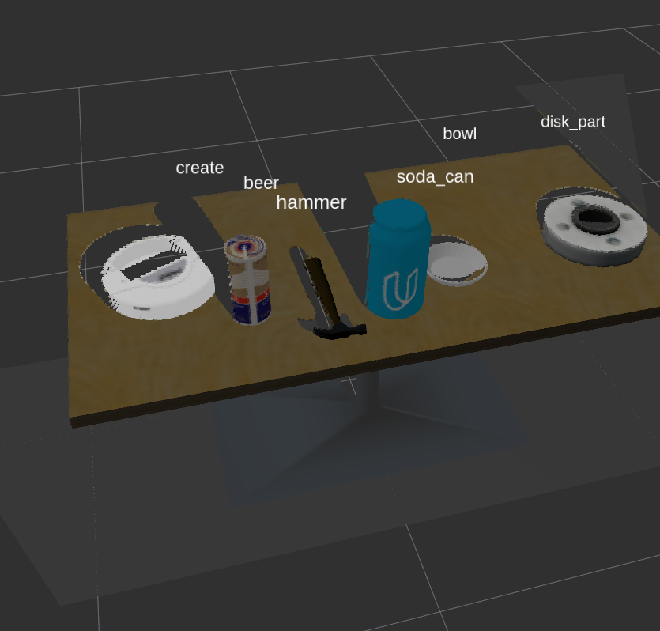

# roboND Proj3: 3D Perception Pick & Place
### Submission writeup: ChrisL

---



<br/>

## **Overview**
Yet another fun but challenging assignment!
The goals / steps of this project are the following:
Using python in a ROS/Gazebo environment

* Develop point cloud pre-processing tools for use in the following 3D perception pipeline
    * Voxel downsampling
    * Passthrough filtering for region-of-interest selection
    * RANSAC table/objects segregation
    * Noise reduction
    * Euclidean clustering
    * Extract object HSV and Normal histogram "features"
    
* Develop point cloud image recognition training tools to create an Suppor Vector Machine (SVM) object classifier
    * Capture object point cloud data sets from ROS/gazebo world
    * Extract object HSV and Normal histograms to use as feature data sets in SVM training
    * Pass histogram feature datasets to a SVM  generator
    * Serialize the generated SVM for later use in the pipeline
    
* Develop code to utilize the SVM object classifier to identify objects as the final step in the integrated 3D perception pipeline
* Integrate the above tools into a ROS node to perform object recognition of objects in the ROS/Gazebo world
* EXTRA: Command the PR-2 robot to move the recognized objects into the designated bins
   
### Note to Reviewer:
My project structure is not 'standard'. To review the code or especially if you wish to attempt running the code
please look over the Environment and Usage notes below first.

### Here I will consider the rubric points individually and describe how I addressed each point in my implementation.  

---

## Implementation

### Exercise 1, 2 and 3 pipeline implemented
#### 1. Complete Exercise 1 steps. Pipeline for filtering and RANSAC plane fitting implemented.

#### 2. Complete Exercise 2 steps: Pipeline including clustering for segmentation implemented.  

#### 2. Complete Exercise 3 Steps.  Features extracted and SVM trained.  Object recognition implemented.
Here is an example of how to include an image in your writeup.


#### 1. For all three tabletop setups (`test*.world`), perform object recognition, then read in respective pick list (`pick_list_*.yaml`). Next construct the messages that would comprise a valid `PickPlace` request output them to `.yaml` format.

## Discussion
### 1. Problems I Encountered
### 2. Improvements TODO


---

## Notes
### Environment Notes
I developed this project in a native Mint18.3 linux environment (my laptop), not in the Ubuntu VM. 
It was an ardous journey (see 'Problems I Encountered' above) and I suspect that my python/ROS
environment is different enough from the Udacity VM that my code will not work in that enviroment
without some effort. These notes and the usage notes may help, should one hope to attempt
a run of this project. 

#### Repo Directory Layout
My repo layout differs from the (apparent) ROS project layout convention. The repo root (".")  is not the usual
"catkin_ws/src" folder but above that. It contains "./catkin_ws" and "./catkin_ws/src", the conventional
repo root within it. However "./catkin_ws/devel" and "./catkin_ws/build" are excluded from the repo.
See 'Usage Notes' below to recreate the catkin workspace. <br/>

**Important Directories and files**
* ./catkin_ws/src/RoboND-Perception-Project/ <br/>
This folder contains the [roboND Proj3 Template repo](https://github.com/udacity/RoboND-Perception-Project)
as code, not a git sub module, as is, without modifications except <br/>
```./catkin_ws/src/RoboND-Perception-Project/pr2_robot/launch/pick_place_project.launch```
as needed for selecting the different worlds.

* ```./catkin_ws/src/sensor_stick``` and ```./catkin_ws/src/sensor_stick/scripts```
These directories are grafted from my exercises repo and are the location of my project 3 code. In particular
    * [segmentation.py](./catkin_ws/src/sensor_stick/scripts/segmentation.py)<br/>
    This is the "main" project file that implements the ROS node processing and that invokes the point cloud
    processing and image recognition and publishes the various ROS topics and outputs the yaml files.

    * [pclproc.py](./catkin_ws/src/sensor_stick/scripts/pclproc.py)<br/>
    This file contains the pcl processing functions that comprise point cloud processing functions.
 
     * [capture_features.py](./catkin_ws/src/sensor_stick/scripts/capture_features.py)<br/>
     My (modified) code for acquiring object pointclouds and saving histogram feature sets 
     to be used by the training module.

     * [train_svm.py](./catkin_ws/src/sensor_stick/scripts/train_svm.py)<br/>
     My (modified) code for consuming the object feature sets and creating and serializing an SVM classifier
     
     * [Assets](./catkin_ws/src/sensor_stick/scripts/Assets)<br/>
     Contains a variety of input and output files, including the SVM classifiers
     
     * ```./catkin_ws/src/sensor_stick/scripts/Assets/yamlOut```<br/>
     Contains the final output files:<br/>
     [yaml 1](./catkin_ws/src/sensor_stick/scripts/Assets/yamlOut/world_1_keep.yaml)<br/>
     [yaml 2](./catkin_ws/src/sensor_stick/scripts/Assets/yamlOut/world_2_keep.yaml)<br/>
     [yaml 3](./catkin_ws/src/sensor_stick/scripts/Assets/yamlOut/world_3_6of8.yaml)<br/>
     

### Usage Notes
 and must be created with ```./catkin_ws> catkin_make```

### Acknowledgements
Most of my code is adapted from code presented in the lessons.
However I have used code from other projects: <br/>

Due to "Problems I Encountered" (see above), I visited several repos of other students
to help me resolve the problems. I did not keep a list of all of those repos but this one
[Helpful debug repo from another student](https://github.com/prasanjit6485/RoboND-PerceptionProject.git)<br/>
in particular was very helpful in resolution of my problems. 


I incorporated some
of his ```def pr2_mover(object_list):``` code in my own to get things working. 
I made and effort to rewrite the code that didn't originate from the lessons 
but there is likely some 'residue' of his code in my own. 
I also compared final yaml output files to confirm correctness. 
I have sent an [email](prasanjit6485@gmail.com) to Prasnjit to acknowledge and thank
him.

## Links
[My roboND Project 3](https://github.com/cielsys/RoboNDProj3_3DPerception)
This, my main project 3 repo

[roboND Proj3 Exercises1,2,3 Repo](https://github.com/cielsys/RoboNDProj3_Exercises)
This repo contains the code I developed for the point cloud preprocessing steps. It is **now obsolete**
as the code was integrated into and modified, in many cases, in the main project 3 repo 

[roboND Proj3 Template repo](https://github.com/udacity/RoboND-Perception-Project)

[Rubric](https://review.udacity.com/#!/rubrics/1067/view) 

